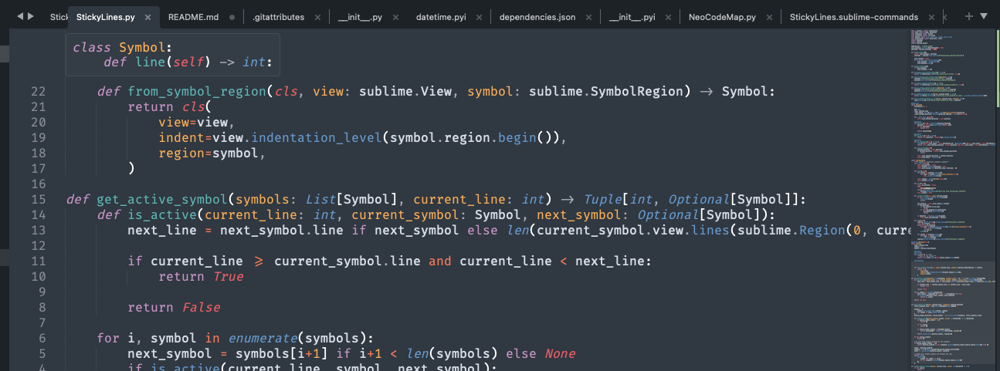
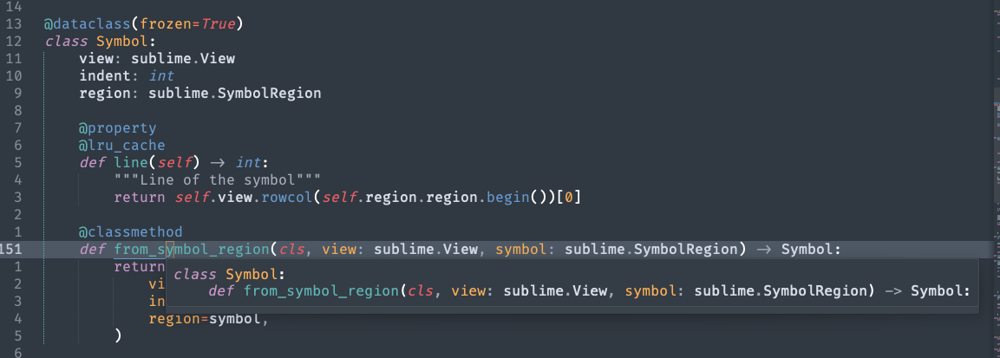

# StickyLines

This plugins aim at always knowing in which class you are located :

* With a [Sticky Scroll](https://code.visualstudio.com/docs/getstarted/userinterface#_sticky-scroll) like behavior like it exists in VS Code
* With an on demand popup

# Installation

This plugin requires Sublime Text >= 4132.

## Package Control

The easiest way to install is using [Package Control](https://packages.sublimetext.io/). It's listed as `NeoCodeMap`.

1. Open `Command Palette` using <kbd>ctrl+shift+P</kbd> (Linux/Windows) or <kbd>cmd+shift+P</kbd> (OSX) or menu item `Tools -> Command Palette...`.
2. Choose `Package Control: Install Package`.
3. Find `StickyLines` and hit <kbd>Enter</kbd>.

## Manual install

Clean repository in your `Packages` directory.

# Usage

## Sticky Scroll

This is the main feature of the plugin. This adds a Phantom at the top your code with the truncated context stack of the current function you are in.

Basically, if you're inside a big class or nested functions, it keeps track of them and display those class and function definition that are out of your viewport at the top.

This is language independent and works as long as the language is supported by Sublime Text.

Note: context depth is tracked through indentation level. This won't work if your code isn't indented properly.

### About performances and jitteriness

There is no way in the Sublime API to react to viewport change. This means that this plugin requires a periodic task to work.

Impact on performances should be minimal but this is important to keep in mind.

The lack of proper UI feature and the use of phantoms also creates some jittering effect on the text buffer. I tried to reduce it at a maximum with some stabilization features but it can only go so far.

You can adapt the stabilization feature by tinkering with `sticky_lines_hysteresis_s`.

For all of this reasons, if you're only interested by the Popup feature or want to completely disable the background periodic task when not needing the plugin, you can set `sticky_lines_auto_follow` to `false` or type `StickyLines: Toggle Auto Follow` in the command palette (`sticky_lines_toggle_auto_follow` command).

### Usage

The default behavior is to always be activated on every view depending on `sticky_lines_enabled_globally` setting. It's default is `true`.

You can change this by going through the settings or using the command palette with `StickyLines: Toggle Globally` (`sticky_lines_toggle_globally` command).

You can override this behavior by toggling this on specific views with `StickyLines: Toggle on View` (`sticky_lines_toggle_on_view` command).

## Popup

This plugin also provides a nice popup that shows those same info but on a popup under your cursor. It has to be called manually with `StickyLines: Show Popup` (`sticky_lines_show_popup` command).

Note: this also relies on code being indented properly.

# Command Palette

Press  <kbd>ctrl+shift+P</kbd> (Linux/Windows) or <kbd>cmd+shift+P</kbd> (OSX). Type `stickylines` to see available commands:

* **Toggle Globally** (`sticky_lines_toggle_globally`): Change default enable behavior of the sticky scroll feature on all views.
* **Toggle on View** (`sticky_lines_toggle_on_view`): Change enable behavior of the sticky scroll feature on the current view.
* **Toggle Auto Follow** (`sticky_lines_toggle_auto_follow`): Enable/Disable the sticky scroll feature completely.
* **Show Popup** (`sticky_lines_show_popup`): Display the stack context popup under your cursor.

# Preferences

| Preference                    | Description                                                                                                                                               | Default |
|-------------------------------|-----------------------------------------------------------------------------------------------------------------------------------------------------------|---------|
| sticky_lines_auto_follow      | Enables auto follow periodic task   Disabling this settings basically disables sticky lines features   Other features like on demand context are still available | true    |
| sticky_lines_enabled_globally | Default behavior of sticky lines on a view   This can be overridden on a per view basis                                                                   | true    |
| sticky_lines_hysteresis_s | Time to wait before considering that the viewport has been stabilized. This might help with jittering                                                                   | 0    |
